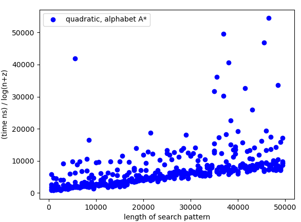

[](https://classroom.github.com/online_ide?assignment_repo_id=9032789&assignment_repo_type=AssignmentRepo)
# Project 3: Suffix array construction

You should implement a suffix array construction algorithm. You can choose to implement the naive O(n² log n)-time construction algorithm based on just sorting all the suffixes using a comparison based algorithm, the O(n²) algorithm you get if you radix sort the suffixes, or you can use the suffix tree from project 2: If you run through the suffix tree, and traverse children in lexicographical order, you will see each leaf in lexicographical order as well, and if you collect all the leaf-labels you have your suffix array.

If you feel adventurous, you are also welcome to implement one of the linear time algorithms *skew* or *SAIS* that we will see the next two weeks, but then you will have to read a bit ahead.

Once you have constructed a suffix array you should use it to implement a binary-search based exact pattern matching. Since I haven’t taught you have to do it faster, it should run in O(m log n + z) where m is the length of the pattern, n is the length of the genome string, and z is the number of matches you output. (One of the algorithms you have seen multiplies z by m, but you know how to avoid this).

Implement the suffix array construction and the exact pattern matching in a single program called `sa`.  The program should take the same options as in project 1, so `sa genome.fa reads.fq`. The program should output (almost) the same Simple-SAM file. Because a search in a suffix array is not done from the start to the end of the string the output might be in a different order, but if you sort the output from the previous project and for this program, they should be identical.

If you start from the sample code provided--found in `progs`, you can build the tool using

```bash
> GOBIN=$PWD go install ./...
```

which will put `sa` in the root of the repository--right where you want it.

## Evaluation

Once you have implemented the `sa` program (and tested it to the best of your abilities) fill out the report below, and notify me that your pull request is ready for review.

# Report

## Algorithm

In our project we have implemented the O(n²) algorithm that uses radix sort instead of the naive comparison based sorting.
Bucket sort can be done in time O(n+k), where n is the length of our array (strings of length n have n or n+1 suffixes). The key is our alphabet, which for numbers would be digits from 0-9. In our case the alphabet is unknown but we have taken the liberty to assume that it is no more than a bytesize (256), since most normal characters fits in this range. This means k is constant and we can describe Bucket sort as O(n). The longest string we sort on has length n and therefore we need to do Bucket sort n times, resulting in the running time O(n²).

For the search part we have implemented a binary search function that finds upper bounds and lower bounds. That variant of binary search runs O(m * log(n+z)) 
To test the expected running time we gave different inputs to our construction implementation based on the english alphabet as this results in more buckets created during the bucket sorting part of the algorithm.
## Insights you may have had while implementing the algorithm

One of the most interesting insights was the great difference in running time for construction vs searching.
This also made it a bit complicated to validate the searching part, since long search times were hard to construct.

## Problems encountered if any

We had some troubles identifiying the different edge cases for the binary search algorithm more specifically the upper and lower bound algorithms. 

## Validation

We created some suffix arrays and did binary search on them. 

First we tested the results on some specific and complex strings in order to see if some edgecases did not work. 
The resulting interval of matches were then checked checked. For suffixes outside the interval we checked that they were not a match, and for values in the interval we obviously checked that they indeed were a match.

Second we compared the results with results from the naive algorithm in project 1. Here we compared two SAM files with the respective outputs.

Last we made a test method to generate many random strings over different alphabets (english, all a's, ACTG) and checked again that all values in interval and outside interval was placed correctly.

## Running time

Construction of the algorithm only depends on the size of our genome or string. If we plot time/n on the y-axis and n on the x-axis we get a linear correlation. From the image the correlation seems pretty clear.


As mentioned we found it a bit complicated to test the search part of the algoritm.
When plotting length of search pattern m on x-axis and time / log(n+z) on the y-axis we would expect a linear relationship.
Since the running times are so fast compared to the time it takes to create the suffix array the measured times are very low which means we have a lot of fluctuations:



One can however clearly see a linear correlation appear in the bottom of the graph.

We also created another graph only varying on m, keeping both n and z constant. (z=0, n=50000).


