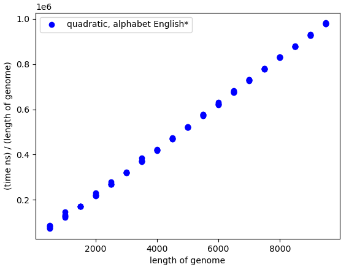

[](https://classroom.github.com/online_ide?assignment_repo_id=9032789&assignment_repo_type=AssignmentRepo)
# Project 3: Suffix array construction

You should implement a suffix array construction algorithm. You can choose to implement the naive O(n² log n)-time construction algorithm based on just sorting all the suffixes using a comparison based algorithm, the O(n²) algorithm you get if you radix sort the suffixes, or you can use the suffix tree from project 2: If you run through the suffix tree, and traverse children in lexicographical order, you will see each leaf in lexicographical order as well, and if you collect all the leaf-labels you have your suffix array.

If you feel adventurous, you are also welcome to implement one of the linear time algorithms *skew* or *SAIS* that we will see the next two weeks, but then you will have to read a bit ahead.

Once you have constructed a suffix array you should use it to implement a binary-search based exact pattern matching. Since I haven’t taught you have to do it faster, it should run in O(m log n + z) where m is the length of the pattern, n is the length of the genome string, and z is the number of matches you output. (One of the algorithms you have seen multiplies z by m, but you know how to avoid this).

Implement the suffix array construction and the exact pattern matching in a single program called `sa`.  The program should take the same options as in project 1, so `sa genome.fa reads.fq`. The program should output (almost) the same Simple-SAM file. Because a search in a suffix array is not done from the start to the end of the string the output might be in a different order, but if you sort the output from the previous project and for this program, they should be identical.

If you start from the sample code provided--found in `progs`, you can build the tool using

```bash
> GOBIN=$PWD go install ./...
```

which will put `sa` in the root of the repository--right where you want it.

## Evaluation

Once you have implemented the `sa` program (and tested it to the best of your abilities) fill out the report below, and notify me that your pull request is ready for review.

# Report

## Algorithm

*Which algorithm did you use to construct the suffix array. What is its running time?*

For this project we choose to implement Radix Sort which runs in O(n^2) time.

## Insights you may have had while implementing the algorithm

## Problems encountered if any

We had some troubles identifiying the different edge cases for the binary search algorithm more specifically the upper and lower bound algorithms. 

## Validation

*How did you validate that the construct and the search algorithm works?*

To validate that the both the SA construction algorithm and binary search works correctly we ran the algorithm on an example string used in the previous project and compared the result from the naive algorithm with the result of our Suffix Array algorithm and verified that they resulted in the same outputs.

## Running time

*List experiments and results that show that both the construction algorithm and the search algorithm works in the expected running time. Add figures by embedding them here, as you learned how to do in project 1.*

The construction of the SA the expected running time should be O(n^2). To test the expected running time we gave different inputs to our construction implementation based on the english alphabet as this results in more buckets created during the bucket sorting part of the algorithm. The running time for this test can be seen . Note that the y-axis is the time spent (in ms), divided by the length of the genome given as input as this gives a linear correlation and thus showing the "correct" expected running time on the worst case input. For smaller alphabets less buckets are required thus resulting in a more desireable running time. 

The expected running time of the search algorith should be O(m log n).
Experiments for the search time were conducted with a fixed n which means that the experiments should show linear behavior depended on the length of the reads. The plot for the search time can be seen in:  where the length of x is fixed at 25,000. Note that y-axis is time (in ms) divided by (m log n). The experiment is conducted on the alphabet of only A's. It is seen in the plot that a line can be visualised through points (with the exception of a few outliers) as the read pattern length increases. This tendency is even more visible in an additional experiment plotted in  where the length of x is fixed at 50,000. 

